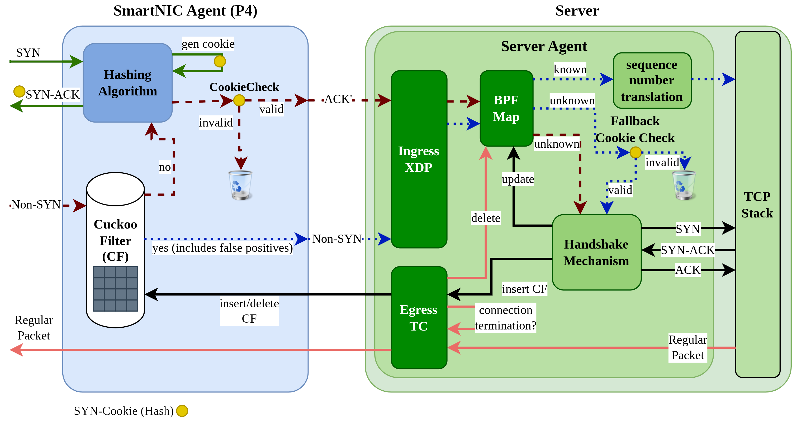

# CuckooGuard: High-Precision SYN Flood Defense for SmartNICs

CuckooGuard is a memory-efficient SYN flood defense architecture developed for SmartNICs, implemented in [P4](https://github.com/p4lang) and eBPF. It offloads TCP connection validation into the data plane and uses a split-proxy design, enabling high-speed filtering of malicious connection attempts while minimizing host CPU overhead.

This project is part of a Master's Thesis at National Tsing Hua University and builds upon recent academic work to make practical, scalable DDoS protection viable on resource-constrained programmable network devices.

- [Paper: CUCKOOGUARD: A Memory-Efficient SYN Flood Defense Architecture for SmartNICs](docs/CuckooGuard_Paper.pdf)

---

## Motivation

SYN floods remain a prevalent form of Distributed Denial-of-Service (DDoS) attack. Traditional defenses either burden the host CPU (e.g., kernel-level SYN cookies) or are too coarse-grained to be effective.

CuckooGuard is designed to:

- Reduce CPU overhead by filtering illegitimate TCP handshakes at the SmartNIC.
- Minimize memory usage using Cuckoo filters instead of conventional Bloom filters.
- Enable precision filtering with explicit connection removal support and low false positive rates.

---

## Architecture Overview

CuckooGuard consists of two main components:

- **SmartNIC Agent (P4)**: Runs on a programmable SmartNIC (simulated via BMv2) and handles line-rate SYN packet filtering using SYN-Cookies and a Cuckoo filter-based flow tracker.
- **Server Agent (eBPF)**: Validates final ACKs, manages TCP sequence number translation, and maintains the lifecycle of tracked flows via eBPF maps in the kernel.

The system is designed to operate transparently. Legitimate clients complete handshakes normally and experience no unusual behavior.



---

## Components and Code Structure

This repository contains several demonstration modules and implementations:

- `demo-python-cuckoo`: A reference implementation of a Cuckoo filter in Python, used for conceptual validation and debugging.
- `demo-split-proxy`: A split-proxy implementation based on SYN Cookies and Bloom filters. This is a port of the original [SMARTCOOKIE](https://github.com/Princeton-Cabernet/p4-projects/tree/master/SmartCookie) design to BMv2.
- `demo-split-proxy-cuckoo`: The main implementation of CuckooGuard, featuring a SYN Cookie-based split-proxy architecture with Cuckoo filter support in BMv2 and eBPF-based connection tracking.
- `demo-syn-cookie`: A standalone SYN proxy implementation in P4 without eBPF integration. Based on the reference design from [syn-proxy/P4-implementations](https://github.com/syn-proxy/P4-implementations).

Each `demo-*` directory follows a unified structure:
- `implementation/`: Contains the core implementation in P4 and eBPF (if applicable).
- `integration-test/`: Includes scripts for end-to-end testing using Mininet and a basic network application.
- `unit-test/`: Provides fine-grained test cases for packet-level verification and debugging.

Additional top-level directories:
- `experiments/`: Scripts used for performance evaluation, including false positive rate analysis and insertion overhead.
- `docs/`: Contains architectural diagrams, implementation details, and evaluation summaries.

---

## Emulation Environment

CuckooGuard is designed and tested using the following emulation tools and settings:

- **BMv2**: Behavioral model software switch for P4-based data plane simulation.
- **Linux namespaces**: Used with virtual Ethernet pairs to simulate server/SmartNIC separation.
- **CRC32 hashing**: Used for cookie and Cuckoo hashing (due to BMv2 limitations; hardware deployments should replace this with a secure cryptographic hash).

---

## Setup Instructions

### Prerequisites

The implementation was tested on:

- **Operating System**: Ubuntu 20.04.6 LTS
- **Kernel Version**: 5.15.0-134-generic

### Required Software

- [BMv2 behavioral model](https://github.com/p4lang/behavioral-model)
- [Tutorials on BMv2](https://github.com/p4lang/tutorials)
- `clang`, `llvm`, `bpftool` for compiling and loading eBPF programs
- Python 3

For example:
``` bash
sudo apt install linux-tools-5.15.0-131-generic
```
---

## Running CuckooGuard

For detailed instructions on running the architecture or specific experiments, refer to the following scripts included in the repository.

### Integration Test

To launch the full integration test of the Cuckoo-based split proxy:

[`demo-split-proxy-cuckoo/integration-test/integration-test-split-proxy-cuckoo.sh`](demo-split-proxy-cuckoo/integration-test/integration-test-split-proxy-cuckoo.sh)

This script sets up BMv2, P4Runtime, the eBPF agents, and a test network application using Mininet namespaces.

### Evaluation and Comparison

To run a comparative benchmark of all available implementations (e.g., Bloom filter vs. Cuckoo filter):

[`experiments/compare-fp-rate.sh`](experiments/compare-fp-rate.sh)

This script executes multiple test runs and reports false positive rates and performance metrics for each variant.


### Manual Execution Outline

If you prefer to run the components manually, follow these general steps:

1. Compile and start the P4 program using BMv2.
2. Launch a control plane process that programs BMv2 via P4Runtime.
3. Start both parts of the eBPF-based Server Agent, which includes:
   - An XDP program for packet reception and filtering.
   - A TC program for handling egress translation and teardown.

> Note: In some Linux environments, eBPF programs may not bind automatically to the correct virtual interfaces. If this occurs, determine the interface index using `ip link` and manually set it using the `IFINDEX` argument for the eBPF loading scripts.